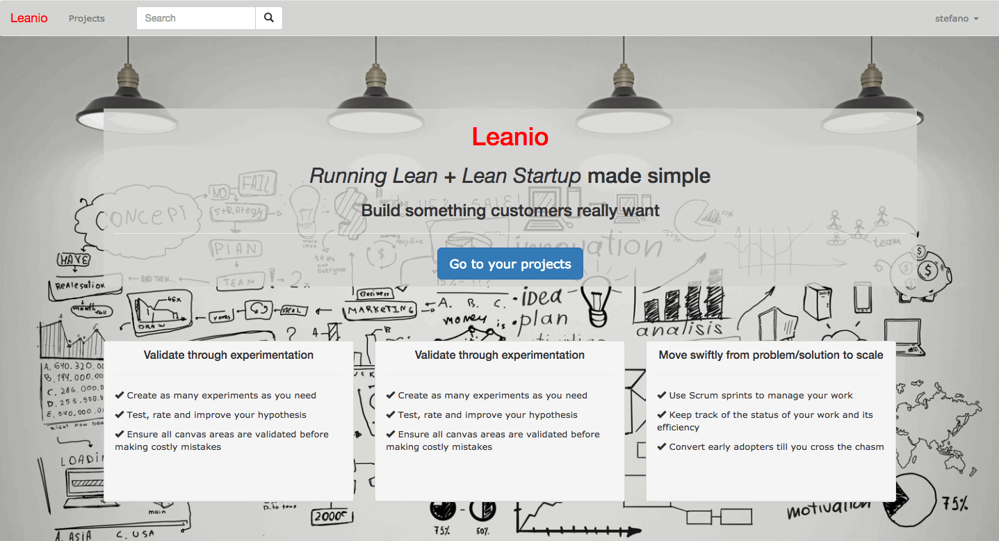
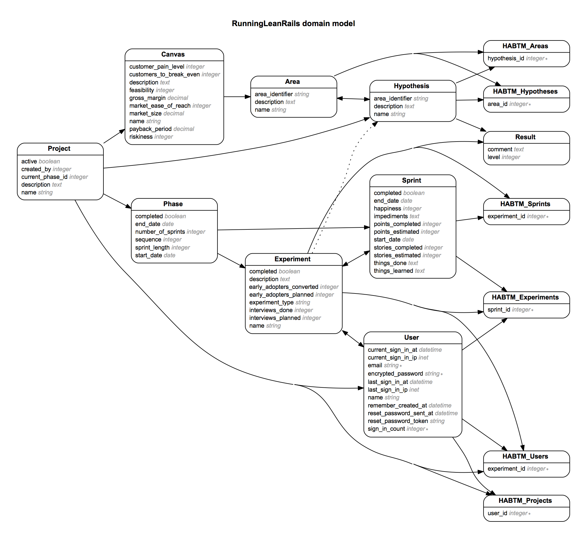
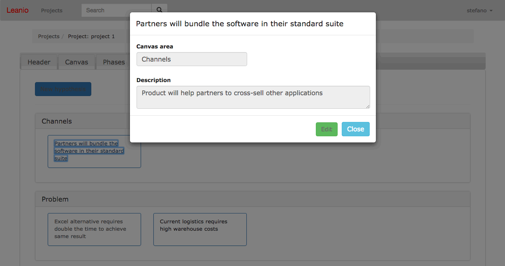

#### Web application that helps innovators and entrepreneurs manage their ideas using the _Lean Startup_ and _Running Lean_ methodologies.



App demo is live at [Leanio.com](http://www.leanio.com)

#### Technical Platform
* Built with **Ruby on Rails**, **postgreSQL** and some **AJAX** (with **JQuery**).
* Testing with **RSpec**, **Capybarra** and **Factory Girl**
* Front-end with **JQuery-UI** and **Bootstrap 3**

## Features

* Create projects and invite other users to participate
  * Work on project ideas following the standard lean phases of _problem/solution fit_, _market/solution fit_ and _scale_
  * Organise activity in _sprints_ for each phase
  * Users can only see their projects and the projects they are invited to participate

* Use multiple _lean canvas_ for each projects
  * Assign hypotheses to each of the canvas areas (problem, solution, key metrics, cost structure, revenue streams, unique value proposition, unfair advantage, channels, customer segments)
  * Capture canvas metrics and prioritise your work

* Validate ideas through experimentation
  * Assign multiple hypothesis to each experiment
  * Run multiple experiment across multiple sprints

## Data model



## Code examples

#### Business logic to automatically create multiple sprints with dates based on user's input of phase start date, number of sprints and sprint length ([models/phase.rb](./app/models/phase.rb))

```ruby
before_save :set_sprints

def set_sprints

  start_date_valid = self.start_date.present?
  number_of_sprints_valid = self.number_of_sprints.present? && self.number_of_sprints > 0
  sprint_length_valid = self.sprint_length.present? && self.sprint_length > 0

  if start_date_valid && number_of_sprints_valid && sprint_length_valid

    end_date = get_end_date(self.start_date, self.number_of_sprints, self.sprint_length)
    self.end_date = end_date

    phase_weeks = get_phase_weeks(self.start_date, end_date, self.sprint_length)

    change_sprint_dates(self.sprints, phase_weeks) if self.sprints.present? && !self.sprints.empty?

    add_or_remove_sprints(self, phase_weeks)

  end
end

def get_end_date(start_date, number_of_sprints, sprint_length) # returns the new end date
  duration = number_of_sprints * sprint_length
  start_date + duration.weeks - 1
end

def get_phase_weeks(start_date, end_date, sprint_length) # returns an array of arrays of weeks [start_day, end_day]
  days = (Date.parse("#{self.start_date}")..Date.parse("#{self.end_date}")).to_a
  days.each_slice(self.sprint_length * 7).to_a.map do |w|
    [w.first, w.last].map { |d| "#{d.year}-#{d.month}-#{d.day}" }
  end
end

def change_sprint_dates(sprints, phase_weeks) # changes and saves sprints, returns true if no error
  sprints.each_with_index do |s, i|
    s.start_date = phase_weeks[i][0]
    s.end_date = phase_weeks[i][1]
    s.save
    break if i + 1 == phase_weeks.length # don't allow to go beyond the new number_of_sprints
  end
end

def add_or_remove_sprints(phase, phase_weeks) # destroy() or .build() the sprints referenced by the phase
  sprints_diff = phase.number_of_sprints - phase.sprints.length
  if sprints_diff < 0 # destroy old ones
    sprints_diff.abs.times do |i|
      s = phase.sprints[(phase.sprints.length - 1) - i ]
      Sprint.destroy(s.id)
    end
  end
  if sprints_diff > 0 # add new ones
    sprints_diff.times do |i|
      j = phase.sprints.length # this length will increase by 1 at each iteration because you're adding to the array!
      phase.sprints.build(start_date: phase_weeks[j][0], end_date: phase_weeks[j][1])
    end
  end
end
```

#### Add or remove hypotheses to a canvas area ([models/area.rb](./app/models/area.rb))

```ruby
def add_hypothesis(hypothesis_id)
  begin
    hypothesis = Hypothesis.find(hypothesis_id)
    if self.hypotheses.include?(hypothesis)
      self.errors.add :base, 'This hypothesis has already been added'
      return false
    else
      self.hypotheses << hypothesis
      self.save!
    end
  rescue
    self.errors.add :base, 'Hypothesis not found'
    return false
  end
end

def remove_hypothesis(hypothesis_id)
  begin
    hypothesis = Hypothesis.find(hypothesis_id)
    if self.hypotheses.include?(hypothesis)
      self.hypotheses.delete(hypothesis)
      self.save!
    else
      self.errors.add :base, 'This hypothesis has already been added'
      return false
    end
  rescue
    self.errors.add :base, 'Hypothesis not found'
    return false
  end
end
```

#### Dynamically show to the user only the hypothesis that are relevant ([models/area.rb](./app/models/area.rb))

```ruby
def options_for_select_hypotheses
  # Get only hypotheses with that area_identifier that have not yet been associated with this area
  h_not_associated = Hypothesis.includes(:areas).where(area_identifier: self.area_identifier).where(areas: {id: nil})
  h_not_this_area = Hypothesis.includes(:areas).where(area_identifier: self.area_identifier).where.not(areas: {id: self.id})
  (h_not_associated + h_not_this_area).map { |h| [h.name, h.id] }
end
```

#### Allow user to add project members to a specific experiment ([models/experiment.rb](./app/models/experiment.rb))

```ruby
def add_user(user_id)
  user = User.find_by(id: user_id)
  if !self.phase.project.users.include?(user)
    self.errors.add :base, 'This user is not a project user'
    return false
  elsif self.users.include?(user)
    self.errors.add :base, 'This user has already been added'
    return false
  else
    begin
      self.users << user
      self.save!
    rescue
      self.errors.add :base, 'This user cannot be added'
      return false
    end
  end
end

def remove_user(user_id)
  user = User.find_by(id: user_id)
  if !self.users.include?(user)
    self.errors.add :base, 'This user was not added to the experiment'
    return false
  else
    begin
      self.users.destroy(user)
      self.save!
    rescue
      self.errors.add :base, 'This user cannot be removed'
      return false
    end
  end
end
```

#### Calculate useful statistics for a sprint ([models/sprint.rb](./app/models/sprint.rb))

```ruby
def stories_completion
  stories_completed = self.stories_completed ||= 0
  stories_estimated = self.stories_estimated ||= 0
  number = stories_completed - stories_estimated
  ratio = number.to_f != 0 ? number.to_f / self.stories_estimated : 0
  {number: number, ratio: ratio}
end

def points_completion
  points_completed = self.points_completed ||= 0
  points_estimated = self.points_estimated ||= 0
  number = points_completed - points_estimated
  ratio = number.to_f != 0 ? number.to_f / self.points_estimated : 0
  {number: number, ratio: ratio}
end
```

#### Modal with AJAX to create, edit and delete an hypothesis ([views/hypotheses/edit.js.erb](./views/hypotheses/edit.js.erb))



```javascript
// Dislay the modal content
$("#show-hypothesis").html("<%= escape_javascript(render 'hypotheses/modal_edit') %>");

// Get IDs
var modalDialog = $(".modal-dialog");
var projectId = modalDialog.data('project-id');
var hypothesisId = modalDialog.data('hypothesis-id');

// Get current area_identifier
var hypothesisAreaIdentifier = modalDialog.data('hypothesis-area-identifier');

// Show error message
function showError(message) {
  $(".modal-dialog").addClass("error");
  var errorElement = $("<small></small>")
    .attr('id', 'error_message')
    .addClass('error')
    .html(message);
  $(errorElement).appendTo('form .field');
}

// Create a new area
function getNewArea(data){
  var areasRow = $("#areas-row");
  areasRow.append(
    $('<div/>', {'class': 'col-xs-12', 'id': 'area-col-' + data.area_identifier.split(" ").join("-")}).append(
      $('<div/>', {'class': 'panel panel-default'})
      .append(
        $('<div/>', {'class': 'panel-heading'}).append(
          $('<h6/>', {'class': 'panel-title', 'text': data.area_identifier})
        )
      )
      .append(
        $('<div/>', {'class': 'panel-body'})
      )
    )
  );
  return $("#area-col-" + data.area_identifier.split(" ").join("-"));
}

// Create new link panel for an hypothesis
function createNewLinkPanel(data, areaCol){
  var col = $("<div></div>");
  col.addClass("col-sm-3");
  col.attr('id', "hypothesis-col-" + data.id);

  var heading = $("<div></div>");
  heading.addClass("panel panel-primary panel-heading");
  heading.attr('style', "height: 80px; overflow: hidden; white-space: normal;");

  var p = $("<p></p>");

  var newLink = $("<a></a>")
  newLink.attr('data-toggle', "modal");
  newLink.attr('data-target', "#show-hypothesis");
  newLink.attr('id', "hypothesis-link-" + data.id);
  newLink.attr('data-remote', "true");
  newLink.attr('href', "/projects/"+data.project_id+"/hypotheses/"+data.id);

  areaCol.find('.panel-body').append(col.append(heading.append(p.append(newLink))));
}

// EDIT hypothesis
function editHypothesis(event){
  event.preventDefault();

  // get edited object
  var editedHypothesis = {
    id: hypothesisId,
    project_id: projectId,
    area_identifier: $("#hypothesis_area_identifier").val(),
    name: $("#hypothesis_name").val(),
    description: $("#hypothesis_description").val()
  };

  $.ajax({
    type: "PUT",
    url: "/projects/"+projectId+"/hypotheses/"+hypothesisId+".json",
    data: JSON.stringify({
        hypothesis: editedHypothesis
    }),
    contentType: "application/json",
    dataType: "json"})

    .done(function(data) {
      // If the area_identifier changed, delete old panel and create a new one in the right area
      // however, the right area may not exist yet becuse before it had no hypotheses.
      if(hypothesisAreaIdentifier !== data.area_identifier){
        // Remove old hypothesis
        $("#hypothesis-col-"+hypothesisId).remove();
        // Create a new area if the area doesn't exist
        var areaCol = $("#area-col-" + data.area_identifier.split(" ").join("-"));
        if(areaCol.length === 0){
          areaCol = getNewArea(data);
        }
        // Create and append the new link panel
        createNewLinkPanel(data, areaCol);
      }
      // Update link name on project show view
      $("#hypothesis-link-"+hypothesisId).html(data.name);
      // Close modal
      $("button#close-modal").click();
    })

    .fail(function(error) {
      console.log(error);
      error_message = error.responseJSON.title[0];
      showError(error_message);
    }
  );
}

// DELETE hypothesis
function deleteHypothesis(event){
  event.preventDefault();

  $.ajax({
    type: "DELETE",
    url: "/projects/"+projectId+"/hypotheses/"+hypothesisId+".json",
    contentType: "application/json",
    dataType: "json"})

    .done(function(data) {
      // Remove hypothesis
      $("#hypothesis-col-"+data.id).remove();
      // Close modal
      $("button#close-modal").click();
    })
    .fail(function(error) {
      console.log(error);
      error_message = error.responseJSON.title[0];
      showError(error_message);
    }
  );
}

// After loading: bind submit event
$(document).ready(function() {
  $("#submit-edit").bind('click', editHypothesis);
  $("button#delete").bind('click', deleteHypothesis);
});

```
